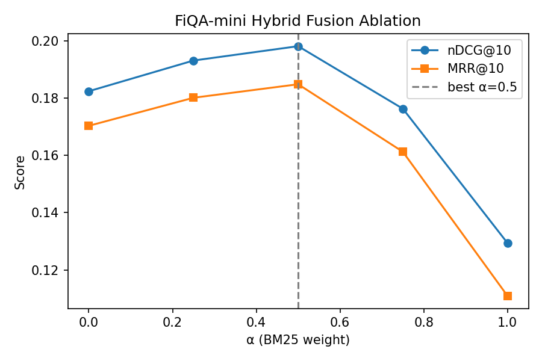

# Neural Retrieval Engine with Hybrid Ranking

Local-first hybrid search (sparse + dense) with learnable fusion and latency-aware tuning.
This repo starts light (toy dataset + BM25 baseline via rank-bm25) and grows to FAISS/Pyserini.

## Quickstart
```bash
python -m venv .venv && source .venv/bin/activate
pip install -e .[dev]

## Results (FiQA-mini, 10k docs)

**Baselines**
- BM25: nDCG@10 ≈ 0.093, MRR@10 ≈ 0.082
- Dense (MiniLM, FAISS): nDCG@10 ≈ 0.182, MRR@10 ≈ 0.170

**Hybrid (BM25 + Dense, α-sweep)**
- Best α ≈ 0.5 → nDCG@10 ≈ 0.198, MRR@10 ≈ 0.185

**Latency (CPU, 10k docs, FAISS-HNSW)**
- Query encoding: P50 ≈ 0.43s, P95 ≈ 0.52s
- ANN search: P50 ≈ 8.9ms, P95 ≈ 12.1ms

> Exact numbers vary by machine and run; see `results/` JSON logs.

## Quickstart (FiQA-mini)
```bash
# Build ANN index and run search
make faiss-build
make faiss-search

# Hybrid sweep (saves results/fiqa_hybrid_sweep.json)
python scripts/fiqa_hybrid_sweep.py

## Ablation Study

To understand the effect of hybrid weighting (α · BM25 + (1–α) · Dense), we swept α ∈ {0.0, 0.25, 0.5, 0.75, 1.0} on FiQA-mini (10k docs).

- BM25-only (α=1.0): **nDCG@10 ≈ 0.093**
- Dense-only (α=0.0): **nDCG@10 ≈ 0.182**
- Hybrid (α≈0.5): **nDCG@10 ≈ 0.198**

This shows hybrid fusion improves over either baseline.

<p align="center">
  
</p>
